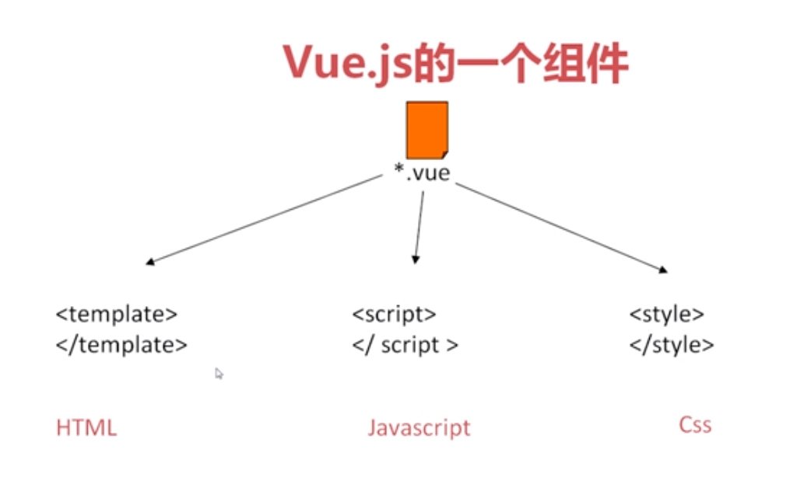

# vue的基本结构使用 
### 从.vue到页面
- 通过webpack之类的 工程化 工具就可以将一个vue文件打包成一个 html css js 文件
    + js 就相当于一个 new vue({})对象
    + 数据层都在 js内
    + 展现层 都在 html内
##### vue.js的一个组件
- 主要分为  
    + <template></template> ----html
    + <script></script> --- js
    + <style></style> --- css 

  

### vue.js组件的重要组件
- new 一个vue对象的时候可以设置他的属性，其中包括最重要地方三个 data, methods ，watch
    + data 代表vue对象的数据，
    + methods代表vue对象的方法，是指页面中使用到的一些方法
    + watch 设置对象监听的方法 
- vue对象里的设置 通过 html指令进行关联
- 重要的指令有
    + v-text v-html {{}}渲染数据 
    + v-if 控制显示
    + v-on 绑定事件
    + v-for 循环渲染等
    + v-bind:sre="xx" 属性绑定

- 注册事件
    + 在vue中，给想要添加事件的标签 添加 
            v-on:click="方法名"
            简写 @click="方法名"
    + 同时需要在vue代码中添加执行的方法函数         

 ```javascript
    var vm = new Vue({
        el:'#app', //表示当前vue对象接管app的div区域
        data: {
            name:'黑马程序员'  // 相当于是MVVM中的Model这个角色
        },
        methods:{
            change:function(){
                this.name += '1';
            }
        }

    });
 ```
- 差值表达式
    + 使用vue内定义好的数据渲染到Vew层 页面层
- 解决闪烁
    + v-text="" 将数据解析为纯文本
    + v-html="" 将数据解析为HTML的格式
    + v-cloak 这个指令保持在元素上直到关联实例结束编译。和 CSS 规则如 [v-cloak] { display: none } 一起用时，这个指令可以隐藏未编译的 Mustache 标签直到实例准备完毕。则标签内的内容就会显示出来，也不会出现闪烁

- v-bind
    + 动态地绑定一个或多个特性，或一个组件 prop 到表达式
    + 只能从数据层赋值给Vew层

- v-model
    + 在表单控件或者组件上创建双向绑定

- v-for
```html
    <div v-for="item in items">
        {{ item.text }}
    </div>
    <!-- 另外也可以为数组索引指定别名 (或者用于对象的键)： -->
```
    + 1.0版本 索引在前
```html
    <div v-for="(index, item) in items"></div>
    <div v-for="(key, val) in object"></div>
```
    + 2.0版本 索引在后 

```html
    <div v-for="(item, index) in items"></div>
    <div v-for="(val, key) in object"></div>
    <div v-for="(val, key, index) in object"></div>
```
- v-if  
    + 根据表达式的值的真假条件渲染元素。在切换时元素及它的数据绑定 / 组件被销毁并重建
- v-else 
    + 前一兄弟元素必须有 v-if 或 v-else-if  

```html
    <div v-if="Math.random() > 0.5">
        Now you see me
    </div>
    <div v-else>
        Now you don't
    </div>
```
- v-show 
    + 根据表达式之真假值，切换元素的 display CSS 属性。    

#### 使用   
      1. 导入vuejs
        <script src="vue.js"></script>
      2. 实例化Vue对象
```html
    <body> <!-- 无法直接接管body -->
        {{ name }}<!-- 只有在vue接管的范围内才可以使用Vue的系统指令呈现数据 -->
	<div id="app">
	<!-- 在Vue接管区域中使用Vue的系统指令呈现数据
	这些指令就相当于是MVVM中的View这个角色 -->
		{{ name }}
	</div>
    </body>
```
```javascript
         //vm :叫做MVVM中的 View Model
          var vm = new Vue({
          el:'#app', //表示当前vue对象接管app的div区域
          data: {
              name:'xxx'  // 相当于是MVVM中的Model这个角色
          }
      });
```

 


