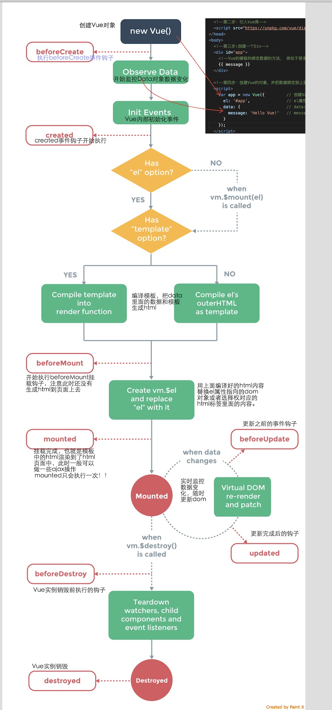

# vue 的生命周期 (钩子)
### 简介

- `beforeCreate` 组件实例刚被创建,组件属性计算之前 执行的`钩子函数`
- `created`  组件实例创建完成之后执行的 `钩子函数`,属性已经绑定,但是DOM还未生成,$el属性还不存在
- `beforeMount` 组件编译/挂载之前 执行
- `mounted` 组件编译/挂载完成之后 执行 不保证组件已在document中 
- `beforeUpdate` 组件更新之前执行的
- `update` 组件更新之后转执行的
- `beforeDestroy` 组件销毁之前执行的
- `destroyed` 组件销毁之后执行的

- 生命周期钩子的 this 上下文指向调用它的 Vue 实例。